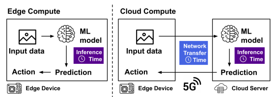
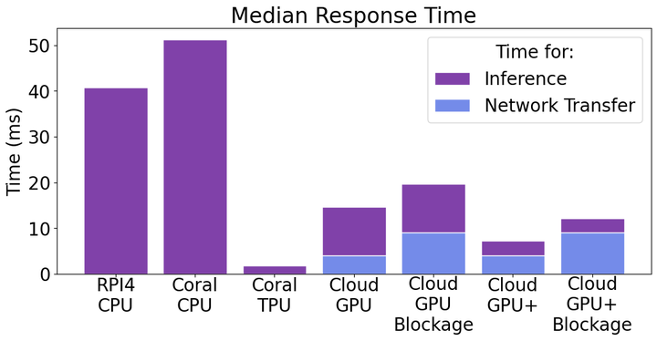

# Evaluating Edge & Cloud Computing for Automation in Agriculture

This experiment compares the latency between edge and cloud computing in an agricultural setting - specifically, for human detection by autonomous vehicles in an orchard.

It should take 2-3 hours to run this experiment.

You can run this experiment on the [Chameleon](https://chameleoncloud.org/) testbed. To run this experiment you should already have an account on Chameleon, be part of a project, and have configured keys on CHI@Edge, CHI@UC, and KVM@TACC.

## Background

### Future of agriculture

New technology can help increase productivity/automation in agriculture. The new wireless network technologies that are part of 5G, such as mmWave band communication, can enable ultra fast data transfer speeds within a private 5G network deployed on a farm. Robotics and artificial intelligence can allow humans and robots to work together in an agricultural setting, improving productivity. However, this requires computation, leading to the question of where compute resources should be placed.


### Edge vs Cloud Computing

Computations can be placed at the edge, or in the cloud. These two paradigms are illustrated below.



In edge computing, input data (in this case an image) is sent to a machine learning (ML) model that is also located on the edge device. The ML model makes a prediction, and the time to generate this prediction from the input is called the *inference time*. Then, some action may be taken - for example, either to continue moving forward or to stop based on whether or not a human is detected in the vehicle path. 

In cloud computing, the input data acquired by the edge device is sent over a network to a ML model that is located on a cloud server. The time it takes to send that input data to the cloud server is called the *network transfer time*. Then, the ML model makes a prediction (again, requiring some *inference time*), and sends it back to the edge device to take an action (again, incurrent some network transfer time). 

Each of these two possibilities comes with tradeoffs. Edge devices are typically inexpensive, low-resource devices, and so edge computing may have a slower inference time. However, in edge computing, data transfer over a network is not required, eliminating the network transfer time. In cloud computing, the cloud servers are generally powerful, since the cost of these powerful servers can be shared across many applications. Therefore, the inference time may be very fast. However, the network transfer time may be slow depending on network conditions. 

The best option for a particular setting will depend on the specific network conditions, the data workload, the machine learning models and techniques involved, and cost considerations. In this experiment, we explore this tradeoff for one specific scenario.

### Experiment Methodology


**Measuring Inference Time**: The [NREC Person Detection Dataset](https://www.nrec.ri.cmu.edu/solutions/agriculture/other-agriculture-projects/human-detection-and-tracking.html) is a collection of labeled videos taken in an apple orchard and orange grove, with visible people in a variety of outfits, locations, and times. We used this dataset to train a human detection model on Google's [Teachable Machines](https://teachablemachine.withgoogle.com/), a simple web interface developed by Google for training machine learning models. We specified two classes, one called "human" and one called "no human," and uploaded the appropriate images for each class. Then, we downloaded the trained model in Keras format (for the cloud computing experiment) and in TFLite and TFLite Coral format (for the edge computing experiments). We will measure inference time on different types of devices using these saved models: 

* a Raspberry Pi 4, with no hardware acceleration for ML (on CHI@Edge)
* a Google Coral Dev Board, with no hardware acceleration *and* with TPU acceleration (using our own devices; these are not yet available on CHI@Edge) 
* a server with GPU (RTX6000), with "vanilla" TensorFlow and with NVIDIA's TensorRT framework for faster inference on NVIDIA GPUs. 

We will repeat each experiment ten times and record the median inference time across trials.
  
**Measuring network transfer time**: To measure network transfer time in a setting representative of a private 5G network, we used [mmWave link traces](https://witestlab.poly.edu/blog/tcp-mmwave/) that had previously been collected by others in our lab.  These include four network scenarios: a scenario with a stable link (no obstructions in the signal path), short blockages in the signal path (e.g. a person walking through the path), long blockages in the signal path (e.g. a person pausing for several seconds in the signal path), and a scenario with blockages where the receiver is also mobile.  We used network emulation to "play back" these traces in a controlled network on KVM@TACC, while continuously transferring test samples from the NREC dataset across the network and measuring the time required to transfer each sample. Then, we noted the typical test sample transfer times during intervals of blockage and during intervals of no blockage. 

(Note that we measure inference time and network transfer time separately, but in the cloud computing scenario, the overall response time includes the sum of these two.)

## Results

Our experiment results are shown below:



* The purple bars show the median inference time for each experiment, and the blue bars show the network transfer times. (Network transfer time only applies to the cloud computing scenarios.) 
* The first three scenarios on the left side show the inference times for three edge computing scenarios, with different edge devices: Raspberry Pi 4 with no hardware acceleration (on CHI@Edge), Google Coral board with no hardware acceleration (our own device), Google Coral board with TPU (our own device).
* The four scenarios on the right side show the inference times and network transfer times for the server with GPU, both without and with the TensorRT optimizations (denoted by GPU+), and for a network link during an interval of no blockage or blockage.

The two edge computing scenarios without hardware acceleration, the Raspberry Pi 4 and the Coral board without acceleration, had the slowest response times (over 40ms). However, for applications where this response time is acceptable (e.g. very low speed vehicles), this may be a preferred solution depending on cost considerations.  The Coral board with TPU acceleration has the fastest response time, less than 5ms. The cloud computing scenario, especially with the TensorRT optimizations, can achieve fast *inference* times comparable to the Coral TPU board. However, due to the added *network transfer* times required for the cloud scenario (4-5ms during intervals with no blockage but 10ms when someone obstructs the signal path), the total response time may be more than 10ms. 

For applications such as high-speed autonomous agricultural robotics that require a reliably small response time less than 10ms, either a very dense mmWave network (to reduce the probability of blockage) or edge devices with hardware acceleration should be deployed. But, both of these options are substantially more expensive than deploying low-cost edge devices for edge computing.

## Run my experiment

### Set up resources at CHI@Edge

First make sure you have a lease for a Raspberry Pi 4, you can find this if you go to the GUI for CHI@Edge, click on reservations, and it should be under leases. If not, create a reservation for a Raspberry Pi 4. Once you have the lease, open this [link](https://github.com/teaching-on-testbeds/edge-cpu-inference/) to access the Edge inferencing on CPU. This will allow us to set up an experiment on Jupyter using a Raspberry Pi 4 to make inferences. 

Once you have a Jupyter Notebook set up you should follow the tutorial, it only takes around 10-15 minutes in total to complete. If you're having trouble finding the lease_id, go back to the Chameleon page where you found if your lease exists, click on lease itself (it should be highlighted in blue) and copy and paste the "Id". Note: "project Id" is something different, do not confuse it for the lease ID. Once you finish the tutorial we are now ready to begin testing images.

Before we go on to the next part of the tutorial, we first need to install our ML model. Click on the human_detection_tflite folder and download the contents inside to your computer as well as the test images called "positives_negatives". 

### Measure inference time at CHI@Edge

On Jupyter, go to the folder that says "image_model". In here, we're going to first delete the original model, labels, and image file by left-clicking on it and pressing delete. The model should be called "model.tflite", if it isn't look for any file that ends in ".tflite". Once we deleted those things we can either drag and drop or copy and paste our "human_detection.tflite" ML model, our labels.txt file, and the test images that we downloaded from this repository (there should be pos1-5 and neg1-5). Now that we have these things downloaded we need to change a few things to begin testing. Go to model.py and first change line 13. Where it says ” `model_path=` “ in the single quotes write `human_detection.tflite`. It should look something like this:  `interpreter = tflite.Interpreter(model_path='model.tflite')`. Next, scroll to the bottom where it says `labels[i].split`. Make sure inside the parenthesis next to the split is empty. Don't delete it, just leave it empty. Finally on line 20 where it says `image_path = 'image_name'`. We're going to rename `image_name` everytime we're doing a different image. `image_path = 'pos_5.png'` is an example of what it'll look like. `pos4.png` would be another possibility. Now that we have these things we're now going to test different images and get different times. 

Your Jupyter environment should be set up, if it isn't, make sure it's all set up. Whenever we test a new image, we begin running code from the "Transfering files to the container" section. This is to make sure we're sending the right images to our ML model. Before we print our results, in the code above be sure to change the `image_model/'image_name' ` to the corresponding image number that you put in the model.py. Now we're ready to see what our model says it predicted and the time it takes to make this prediction. Write this time down with the appropriate images.

Re-do these steps for images 1-10. 

### Set up resources at CHI@UC

First make sure you have a lease for an RTX6000 GPU, you can find this if you go to the GUI for CHI@UC, click on reservations, and it should be under leases. If not, create a reservation for a RTX6000 GPU. Once you have the lease, open this [link](https://github.com/teaching-on-testbeds/cloud-gpu-inference) to access the Cloud inferencing on GPU. This will allow us to set up an experiment on Jupyter using an RTX6000 to make inferences. 

Once you have a Jupyter Notebook set up you should follow the tutorial, it only takes around 10-15 minutes in total to complete. If you're having trouble finding the lease_id, go back to the Chameleon page where you found if your lease exists, click on lease itself (it should be highlighted in blue) and copy and paste the "Id". Note: "project Id" is something different, do not confuse it for the lease ID. Once you finish the tutorial we are now ready to begin testing images.

Before we go on to the next part of the tutorial, we first need to install our ML model. Click on the human_detection_keras folder and download the contents inside to your computer. You should also still have the test images downloaded to your computer. 


### Measure inference time at CHI@UC

On Jupyter, go to the folder that says "image_model". Here, we're going to first delete the original model, labels, and image file by left-clicking on it and pressing delete. The model should be called "model.h5", if it doesn't look for any file that ends in ".h5". Once we delete those things we can either drag and drop or copy and paste our "keras_model.h5 '' ML model, our labels.txt file, and the test images that we downloaded from this repository (there should be pos1-5 and neg 1-5). Now that we have these things downloaded we need to change a few things to begin testing. 

In model.py:

* Change `model = tf.keras.applications.MobileNetV2(input_shape=INPUT_IMG_SHAPE)` to `model = tf.keras.saving.load_model('model.h5')`
* Change `image_path = 'parrot.jpg'` to replace with whatever the name of your test image is.
* Change `imagenet_labels = np.array(open(url).read().splitlines())[1:]` to `imagenet_labels = np.array(open('labels.txt').read().splitlines())[1:]`

In model-convert.py:

* Change `model = tf.keras.applications.MobileNetV2(input_shape=INPUT_IMG_SHAPE)` to `model = tf.keras.saving.load_model('model.h5')`

In model-opt.py:

* Change `image_path = 'parrot.jpg'` to replace with whatever the name of your test image is
* Change `imagenet_labels = np.array(open(url).read().splitlines())[1:]` to `imagenet_labels = np.array(open('labels.txt').read().splitlines())[1:]`
* you may also have to change the word: `predictions` in `top_3 = np.argsort(output["predictions"].numpy().squeeze())[-3:][::-1]` and `print('{:.6f}'.format(output["predictions"].numpy()[0, i]), ':', imagenet_labels[i])` to `sequential_3`


Your Jupyter environment should be set up, if it isn't, make sure it's all set up. Whenever we test a new image, we begin running code from the "Transfering files to the container" section. This is to make sure we're sending the right images to our ML model. Before we print our results, in the code above be sure to change the '''image_model/'image_name' ''' to the corresponding image number that you put in the model.py. Now we're ready to see what our model says it predicted and the time it takes to make this prediction. Write this time down with the appropriate images.

Re-do these steps for images 1-10. 

### Set up resources at KVM@TACC

First you must make sure you're able to set up instances at KVM@TACC. If you have access to this we can continue.

Once you're certain you have access to KVM@TACC, open this [link](https://github.com/teaching-on-testbeds/network-emulation) network emulation. This will allow us to set up an experiment on Jupyter and runs us through a quick tutorial on how to use network emulation. 

The tutorial takes around 10-15 minutes to run through, please complete the tutorial before continuing to set up the mmWave Wireless link trace. 


### Measure network transfer times at KVM@TACC

Now that you understand how to use KVM@TACC, we're going to set up our network to emulate a mmWave wireless link trace. 
Please follow this [link](https://witestlab.poly.edu/blog/tcp-mmwave/) which provides the steps necessary to recreate a mmWave scenario. Only follow the "Set Up Resources" section, the rest will be done here. 

*When configuring your settings in the router, make sure you change the IP address to the correct one in the tputvary.sh bash script.

Now we have to upload our images to Romeo so they can be sent to Juliet.
Run this code on your Jupyter notebook:

```
remote_romeo.run("sudo apt update; sudo apt install apache2")
```

*In a terminal on your LAPTOP - transfer files to home directory on romeo -

```
scp -o StrictHostKeyChecking=no -i ~/.ssh/id_rsa_chameleon -r  /Users/albertonajera/Desktop/positives cc@129.114.27.1:~/
```

Once the images are in Romeo, we are now going to begin sending images from Romeo to Juliet through our mmWave configured router. On router we're going to run one of four commands:
```linux
bash tputvary.sh sl  
bash tputvary.sh sb  
bash tputvary.sh lb
bash tputvary.sh mobb
```
What these commands do will emulate a specific network scenario in mmWireless link. sl being static link, sb = short blockage, ls = long blockage, and mobb = mobility. When we run one of these we'll quickly go to juliet and run one of four commands:

```
curl -so /dev/null -w "%[time_total}\n" http://10.10.1.100/positives_negatives/post.1png?[1-2000000000] &> /dev/stdout sl-results.txt 
curl -so /dev/null -w "%[time_total}\n" http://10.10.1.100/positives_negatives/post.1png?[1-2000000000] &> /dev/stdout sb-results.txt
curl -so /dev/null -w "%[time_total}\n" http://10.10.1.100/positives_negatives/post.1png?[1-2000000000] &> /dev/stdout lb-results.txt
curl -so /dev/null -w "%[time_total}\n" http://10.10.1.100/positives_negatives/post.1png?[1-2000000000] &> /dev/stdout mobb-results.txt
```

These commands will Send an image (specifically post1.png) back and forth from Romeo to Juliet and time the amount it takes each time. You will run each one with the corresponding mmWave scenario. sl will go with sl, sb with sb, etc. After running the command on Juliet let it run for 110 seconds. Once you finish running the command the txt files will download to your Jupyter environment. From there you can then download the files to your computer by left clicking on the txt file in your Jupyter notebook and downloading it.


## Notes

### References
Chameleon, NYU Tandon School of Engineering, Center for Advanced Technology in Telecommunications, the Pinkerton Foundation, Center for k12 STEM Outreach Program

### Acknowledgements
I'd like to acknowledge support of NYU TANDON, K12 STEM outreach center, The Pinkerton Foundation, and my mentors at the New York State Center for Advanced Technology in Telecommunications: Chandra Shekhar Pandey and Fatih Berkay Sarpkaya
